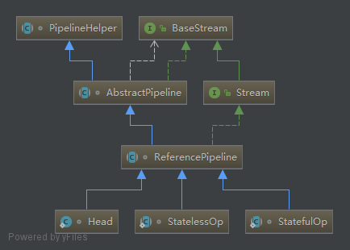

# stream流水线
项目过程中已经经常使用Stream API，但是对于底层实现还一直很迷茫，接下来就看下Stream API的底层是如何实现的
## 基础概念
Stream的使用经常和lambda表达式一起出现，[lambda的实现原理](lambda.md)前面已经介绍了，讲解前我们先了解下一些概念方便后面讲解

Stream操作分类|-|对应Stream方法
---|---|---
中间操作|无状态|filter，map，mapToInt，mapToLong，mapToDouble，flatMap，flatMapToInt，flatMapToLong，flatMapToDouble，peek
-|有状态|distinct，sorted，sorted，limit，skip
终端操作|非短路操作|forEach，forEachOrdered，toArray，reduce，collect，min，max，count
-|短路操作|anyMatch，allMatch，noneMatch，findFirst，findAny
* 中间操作
> 只是一种标记，中间操作又可以分为无状态和有状态
> * 无状态
>> 元素的处理不受前面元素的影响
> * 有状态
>> 必须等到所有元素处理之后才知道最终结果，比如sorted就是有状态操作
* 结束操作
> 会触发实际计算，结束操作又可以分为短路操作和非短路操作
> * 短路操作
>> 不用处理全部元素就可以返回结果，比如findFirst找到第一个元素就返回
> * 非短路操作
>> 处理全部元素才可以返回
## 举个例子
下面我们来看一个例子
```java
String[] strings = new String[]{"abc", "def", "abcd", "defg", "1", "2"};
Optional<Integer> a = Stream.of(strings).filter(s -> s.startsWith("a")).map(String::length).sorted().max(Integer::compareTo);
```
代码的意图就是取以a开头字符串的最大长度，一种简单直白的做法就是每次操作都进行迭代，但是效率上是无法接受的，Stream类库的实现就是为了避免多次迭代，其思想就是在一次迭代中尽可能多的执行用户指定的操作

所以Stream类库就是为了解决以下两个问题：
* 迭代次数多，迭代次数跟函数调用次数相等
* 频繁产生中间结果，每次函数调用都产生一次中间结果，存储开销无法接受

如果不使用Stream API大致的实现形式如下：
```java
int maxLength = 0;
for (String string : strings) {
    if (string.startsWith("a")) {
        int length = string.length();
        maxLength = Math.max(length, maxLength);
    }
}
```
## Stream流水线解决方案
大家应该能想到，应该是采用某种方式记录用户的每一步操作，当用户调用结束操作时将之前记录的操作叠加到一起在一次迭代中全部执行掉，根据这个思路我们来解决以下几个问题
1. 用户操作如何记录
2. 操作如何叠加
3. 叠加之后的操作如何执行
4. 执行后的结果（如果有）在哪里

### 用户操作如何记录
这里使用了`操作`一词，指的是中间操作，很多Stream操作会需要一个回调函数（lambda表达式），因此一个完整的操作时<数据来源，操作，回调函数>构成的三元组，Stream中使用stage的概念描述一个完整的操作




看下Stream的类图
