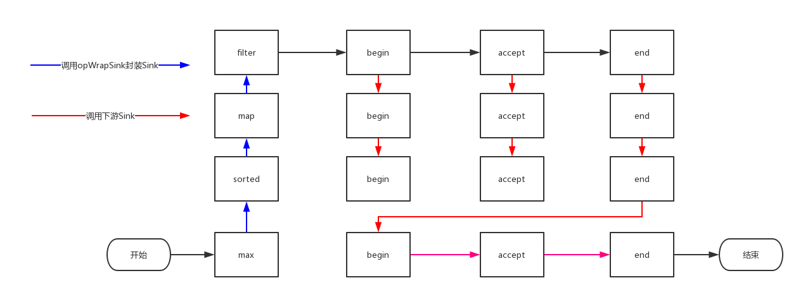

# stream流水线
项目过程中已经经常使用Stream API，但是对于底层实现还一直很迷茫，接下来就看下Stream API的底层是如何实现的
## 基础概念
Stream的使用经常和lambda表达式一起出现，[lambda的实现原理](lambda.md)前面已经介绍了，讲解前我们先了解下一些概念方便后面讲解

Stream操作分类|-|对应Stream方法
---|---|---
中间操作|无状态|filter，map，mapToInt，mapToLong，mapToDouble，flatMap，flatMapToInt，flatMapToLong，flatMapToDouble，peek
-|有状态|distinct，sorted，sorted，limit，skip
终端操作|非短路操作|forEach，forEachOrdered，toArray，reduce，collect，min，max，count
-|短路操作|anyMatch，allMatch，noneMatch，findFirst，findAny
* 中间操作
> 只是一种标记，中间操作又可以分为无状态和有状态
> * 无状态
>> 元素的处理不受前面元素的影响
> * 有状态
>> 必须等到所有元素处理之后才知道最终结果，比如sorted就是有状态操作
* 结束操作
> 会触发实际计算，结束操作又可以分为短路操作和非短路操作
> * 短路操作
>> 不用处理全部元素就可以返回结果，比如findFirst找到第一个元素就返回
> * 非短路操作
>> 处理全部元素才可以返回
## 举个例子
下面我们来看一个例子
```java
String[] strings = new String[]{"abc", "def", "abcd", "defg", "1", "2"};
Optional<Integer> a = Stream.of(strings).filter(s -> s.startsWith("a")).map(String::length).sorted().max(Integer::compareTo);
```
代码的意图就是取以a开头字符串的最大长度，一种简单直白的做法就是每次操作都进行迭代，但是效率上是无法接受的，Stream类库的实现就是为了避免多次迭代，其思想就是在一次迭代中尽可能多的执行用户指定的操作

所以Stream类库就是为了解决以下两个问题：
* 迭代次数多，迭代次数跟函数调用次数相等
* 频繁产生中间结果，每次函数调用都产生一次中间结果，存储开销无法接受

如果不使用Stream API大致的实现形式如下：
```java
int maxLength = 0;
for (String string : strings) {
    if (string.startsWith("a")) {
        int length = string.length();
        maxLength = Math.max(length, maxLength);
    }
}
```
## Stream流水线解决方案
大家应该能想到，应该是采用某种方式记录用户的每一步操作，当用户调用结束操作时将之前记录的操作叠加到一起在一次迭代中全部执行掉，根据这个思路我们来解决以下几个问题
1. 用户操作如何记录
2. 操作如何叠加
3. 叠加之后的操作如何执行
4. 执行后的结果（如果有）在哪里

### 用户操作如何记录
这里使用了`操作`一词，指的是中间操作，很多Stream操作会需要一个回调函数（lambda表达式），因此一个完整的操作时<数据来源，操作，回调函数>构成的三元组，Stream中使用stage的概念描述一个完整的操作，并用某种实例化后的PipelineHelper来代表stage，将具有先后顺序的各个stage连到一起，就构成了整个流水线，看下Stream的类图


图中Head表示第一个stage，比如调用Stream.of(strings)方法产生的stage，很显然这个stage里不包含任何操作，StatelessOp表示无状态stage，StatefulOp表示有状态stage

Head对应
```java
AbstractPipeline(Supplier<? extends Spliterator<?>> source,
                 int sourceFlags, boolean parallel) {
    this.previousStage = null;
    this.sourceSupplier = source;
    this.sourceStage = this;
    this.sourceOrOpFlags = sourceFlags & StreamOpFlag.STREAM_MASK;
    // The following is an optimization of:
    // StreamOpFlag.combineOpFlags(sourceOrOpFlags, StreamOpFlag.INITIAL_OPS_VALUE);
    this.combinedFlags = (~(sourceOrOpFlags << 1)) & StreamOpFlag.INITIAL_OPS_VALUE;
    this.depth = 0;
    this.parallel = parallel;
}
```
StatelessOp和StatefulOp对应
```java
AbstractPipeline(AbstractPipeline<?, E_IN, ?> previousStage, int opFlags) {
    if (previousStage.linkedOrConsumed)
        throw new IllegalStateException(MSG_STREAM_LINKED);
    previousStage.linkedOrConsumed = true;
    previousStage.nextStage = this;

    this.previousStage = previousStage;
    this.sourceOrOpFlags = opFlags & StreamOpFlag.OP_MASK;
    this.combinedFlags = StreamOpFlag.combineOpFlags(opFlags, previousStage.combinedFlags);
    this.sourceStage = previousStage.sourceStage;
    if (opIsStateful())
        sourceStage.sourceAnyStateful = true;
    this.depth = previousStage.depth + 1;
}
```

跟随着stream方法调用，不断产生新的Stream，这些Stream对象以双向链表的形式组织在一起，构成整一个流水线，由于每个stage都记录了前一个stage和本次的操作以及回调函数，依靠这种构成就能建立起对数据源的所有操作，这就是Stream记录操作的方式
### 操作如何叠加
以上只是解决了操作记录的问题，想让流水线起到应有的作用我们需要某种协议来协调相邻stage之间的调用关系，这种协议有Sink接口完成


方法名|作用
---|---
void begin(long size)|开始遍历元素之前调用该方法，通知Sink做好准备
void end()|所有元素遍历完成之后调用，通知Sink没有更多的元素了
void accept(T t)|遍历元素时调用，接受一个待处理元素，并对元素进行处理，stage把自己包含的操作和回调方法封装到该方法里面，前一个stage只需要调用当前stage.accept(T t)方法就行了
boolean cancellationRequested()|是否可以结束操作，可以让短路操作尽早结束

有了以上协议，相邻的stage之间调用就很方便了，每个stage都会将自己的操作封装到一个Sink里，前一个stage只需调用后一个stage的accept()方法即可，实际上Stream API内部实现的本质就是如何重载Sink的这四个接口方法

有了Sink对操作的包装，stage之间的调用问题就解决了，执行时只需要从流水线的Head开始对数据源依次调用每个stage对应的Sink{begin,accept,cancellationRequested,end}方法就可以了，一种可能的Sink.accept()方法流程是这样的：
```java
void accept(T t){
    1. 使用当前Sink包装的回调函数处理
    2. 将处理结果传递给流水线下游的Sink
}
```
Sink接口的其他几个方法也是按照这种（处理->转发）的模型实现的，下面我们看几个例子，Stream.filter()
```java
// 产生一个新的stream的中间操作
@Override
public final Stream<P_OUT> filter(Predicate<? super P_OUT> predicate) {
    Objects.requireNonNull(predicate);
    // 返回一个无状态的操作
    return new StatelessOp<P_OUT, P_OUT>(this, StreamShape.REFERENCE,
                                 StreamOpFlag.NOT_SIZED) {
        @Override
        Sink<P_OUT> opWrapSink(int flags, Sink<P_OUT> sink) {
            return new Sink.ChainedReference<P_OUT, P_OUT>(sink) {
                @Override
                public void begin(long size) {
                    downstream.begin(-1);
                }

                @Override
                public void accept(P_OUT u) {
                    // 处理回调
                    if (predicate.test(u))
                        // 传递结果到下一个stage
                        downstream.accept(u);
                }
            };
        }
    };
}
```
再来看一个复杂的例子，Stream.sorted()
```java
/**
* 显然sorted是一个有状态的操作，排序前需要获得所有的元素，跳过调用链，找到如下代码
* 
*/
private static final class RefSortingSink<T> extends AbstractRefSortingSink<T> {
    private ArrayList<T> list;

    RefSortingSink(Sink<? super T> sink, Comparator<? super T> comparator) {
        super(sink, comparator);
    }

    // 创建一个用于存放元素的列表
    @Override
    public void begin(long size) {
        if (size >= Nodes.MAX_ARRAY_SIZE)
            throw new IllegalArgumentException(Nodes.BAD_SIZE);
        list = (size >= 0) ? new ArrayList<T>((int) size) : new ArrayList<T>();
    }

    @Override
    public void end() {
        // 所有元素接收完毕，进行排序
        list.sort(comparator);
        // 进行下一次迭代前的准备工作
        downstream.begin(list.size());
        if (!cancellationWasRequested) {
            // 下游非短路操作，迭代传递结果
            list.forEach(downstream::accept);
        }
        else {
            // 下游短路操作，迭代短路返回
            for (T t : list) {
                if (downstream.cancellationRequested()) break;
                downstream.accept(t);
            }
        }
        downstream.end();
        list = null;
    }

    // 接收元素
    @Override
    public void accept(T t) {
        list.add(t);
    }
}
```
上述代码完美的展现了Sink的四个接口方法是如何协同工作的：
1. 首先begin()方法告诉Sink参与排序的元素个数，方便确定中间结果容器的大小
2. 之后通过accept()方法将元素添加到中间结果中，最终执行时调用者会不断调用该方法，直到遍历所有元素
3. 最后end()方法告诉Sink所有元素遍历完毕，启动排序步骤，排序完成后将结果传递给下游的Sink
4. 如果下游的Sink是短路操作，将结果传递给下游时不断询问下游的cancellationRequested()是否可以结束处理

### 叠加之后的操作如何执行
Sink完美的封装了Stream每一步操作，并给出了处理-转发的模式来叠加操作，这一连串的齿轮已经咬合，就差最后一步拨动齿轮启动执行，那么这个操作就是结束操作，一旦调用结束操作，就会触发整个流水线的执行

结束操作之后不再有别的操作，所以结束操作不会创建新的流水线阶段stage，结束操作会创建一个包装了自己操作的Sink，这也时流水线中的最后一个Sink，这个Sink只需要处理数据而不需要将结果传递给下游的Sink（因为没有下游），对于Sink的处理->转发模型，结束操作就是调用链的出口

上游的Sink是如何找到下游的Sink的，一种可选的方案是在PipelineHelper中设置一个Sink字段，在流水线中找到下游stage并访问Sink字段即可，但Stream API的设计者没有这么做，而是通过`abstract Sink<E_IN> opWrapSink(int flags, Sink<E_OUT> sink)`方法来得到Sink，该方法的作用是返回一个新的包含了当前stage代表的操作以及能够将结果传递给`downstream`的Sink对象，为什么要产生一个新对象而不是返回一个Sink字段，这是因为使用`opWrapSink()`可以将当前操作和下游的Sink（上文中的`downstream`参数）结合成新的Sink

试想以下只要从流水线的最后一个stage开始，不断调用上一个stage的`opWrapSink()`方法直到最开始（不包括Head，因为Head代表数据源，不包含操作），就可以得到一个代表流水线上所以操作的Sink，用代码表示就是如下：
```java
/**
* 结束操作将调用该方法，从下游开始向上游不断包装Sink，这个入参就是结束操作
*/
@Override
final <P_IN, S extends Sink<E_OUT>> S wrapAndCopyInto(S sink, Spliterator<P_IN> spliterator) {
    copyInto(wrapSink(Objects.requireNonNull(sink)), spliterator);
    return sink;
}
/**
* 函数返回时就可以得到一个代表流水线上所有操作的Sink
*/
@Override
@SuppressWarnings("unchecked")
final <P_IN> Sink<P_IN> wrapSink(Sink<E_OUT> sink) {
    Objects.requireNonNull(sink);

    for ( @SuppressWarnings("rawtypes") AbstractPipeline p=AbstractPipeline.this; p.depth > 0; p=p.previousStage) {
        sink = p.opWrapSink(p.previousStage.combinedFlags, sink);
    }
    return (Sink<P_IN>) sink;
}
```
现在流水线上从开始到结束的所有操作都被包装到一个Sink里，执行这个Sink就相当于执行整个流水线，执行Sink的代码如下：
```java
@Override
final <P_IN> void copyInto(Sink<P_IN> wrappedSink, Spliterator<P_IN> spliterator) {
    Objects.requireNonNull(wrappedSink);

    if (!StreamOpFlag.SHORT_CIRCUIT.isKnown(getStreamAndOpFlags())) {
        // 通知开始遍历，做好准备
        wrappedSink.begin(spliterator.getExactSizeIfKnown());
        // 遍历
        spliterator.forEachRemaining(wrappedSink);
        // 通知遍历结束
        wrappedSink.end();
    }
    else {
        copyIntoWithCancel(wrappedSink, spliterator);
    }
}
```
对于本文中提到的例子，大概的调用过过程如下

### 执行后的结果在哪里
最后一个问题是流水线上所有操作都执行后，用户所需要的结果（如果有）在哪里？

首先要说明的是并不是所有的结束操作都需要返回结果，有些操作只是为了使用其副作用，比如使用Stream.forEach()方法将结果打印出来就是常见的使用副作用的场景（事实上，除了打印之外其他场景都应避免使用副作用）
> 副作用不应该被滥用，也许你会觉得在Stream.forEach()里进行元素手机是不错的选择，就想下面代码那样，但遗憾的是这样使用的正确性和效率都无法保证，因为Stream可能并行执行，大多数使用副作用的地方都可以使用归约操作更安全和有效的完成
```java
// 错误的收集方式
ArrayList<String> s1 = new ArrayList<>();
Arrays.stream(strings).filter(s -> s.startsWith("a"))
        .forEach(s1::add);
// 正确的收集方式
List<String> s2 = Arrays.stream(strings).filter(s -> s.startsWith("a"))
        .collect(Collectors.toList());
```
回到流水线执行结果的问题上来，返回的结果存在哪里呢，这要根据情况讨论：

回访类型|对应的结束操作
---|---
boolean|anyMatch,allMatch,noneMatch
Optional|findFirst,findAny
归约结果|reduce,collect,max,min
数组|toArray

1. 对应于表中返回boolean或者返回Optional的操作由于值返回一个值，只需要在对应的Sink中记录这个值，等到执行结束时返回就可以了
2. 对于归约操作，最终结果放在用户调用时指定的容器中，max()和min()实际上是返回Optional，但事实上底层是通过调用reduce()方法实现的
3. 对于返回数组的情况，结果会放在数组中，但在最终返回数组前，结果其实是存储在一中叫做`Node`的数据结构中，Node是一种多叉树结构，元素存储在树的叶子当中，并且一个叶子节点可以存放多个元素，这样做是为了并行执行方便

## 写在结尾
上面就是关于Stream API的真面目，大家可以通过例子然后单步调试的方式一窥究竟，文中还提到其实Stream是可以并行执行的这个以后有机会再研究

下面是参考资料
* https://github.com/CarpenterLee/JavaLambdaInternals/blob/master/6-Stream%20Pipelines.md