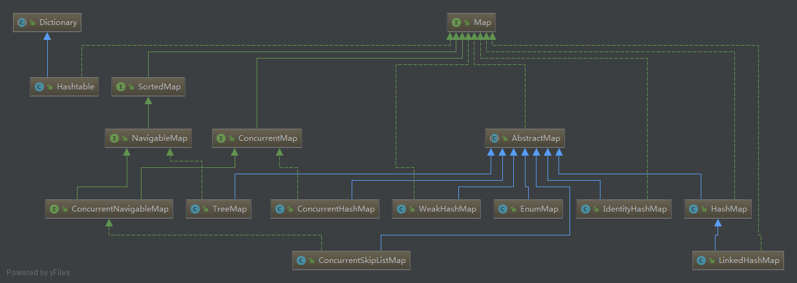

# Map

## [HashMap](map/HashMap.md)
线程不安全

JDK1.8实现和以前略有不同
## [TreeMap](map/TreeMap.md)
基于红黑树实现，线程不安全
## [HashTable](map/HashTable.md)
线程安全，字典的实现
## [LinkedHashMap](map/LinkedHashMap.md)
## [ConcurrentHashMap](map/ConcurrentHashMap.md)
## [ConcurrentSkipListMap](map/ConcurrentSkipListMap.md)
## [IdentityHashMap](map/IdentityHashMap.md)
## [EnumMap](map/EnumMap.md)
## [WeakHashMap](map/WeakHashMap.md)