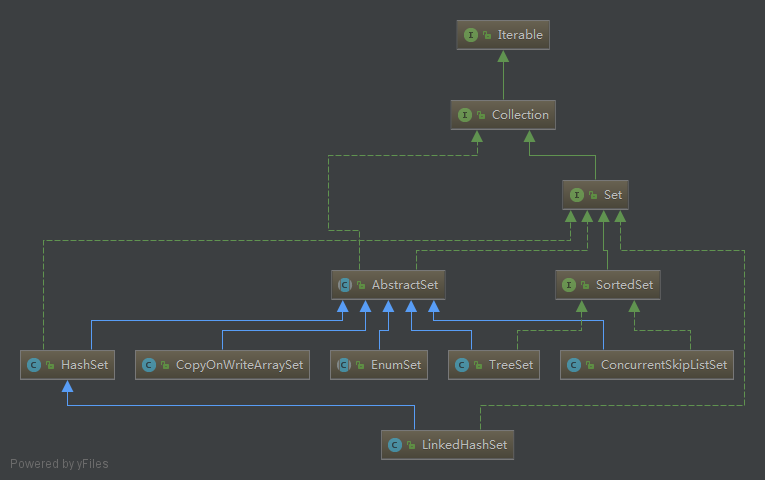

# Set集合

## [HashSet](set/HashSet.md)
线程不安全
## [TreeSet](set/TreeSet.md)
## [LinkedHashSet](set/LinkedHashSet.md)
## [CopyOnWriteArraySet](set/CopyOnWriteArraySet.md)
## [ConcurrentSkipListSet](set/ConcurrentSkipListSet.md)