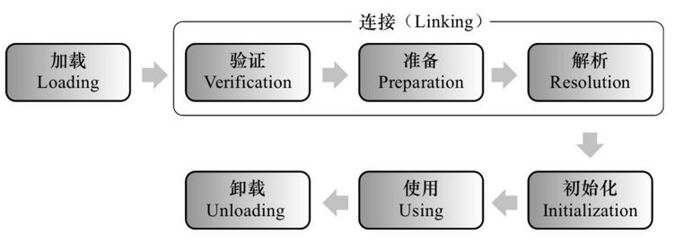

# 类的加载机制

一个Java类从.java文件编译成.class，然后被JVM使用，主要分为以下几个过程：加载、连接、初始化

## 加载
1. 通过一个类的全限定名来获取定义此类的二进制字节流
    * 从ZIP包中读取，比如JAR、EAR、WAR
    * 从网络中获取，比如Applet
    * 运行时计算生成，JDK动态代理，CGLib
    * 由其他文件生成，比如JSP
    * 从数据库中读取，比如oracle
2. 将这个字节流所代表的静态存储结构转化为方法区的运行时数据结构
3. 在内存中生成一个代表这个类的java.lang.Class对象，作为方法区这个类的各种数据的访问入口（反射的基础）

加载（非数组类）过程相对于其他过程，是开发人员可控性最强的，因为加载阶段既可以使用系统提供的引导加载器来完成，也可以有用户自定义的类加载器去完成

数组类本身不是通过类加载器创建的，而是通过Java虚拟机直接创建的，但是数组类的元素类型最终还是靠类加载器创建
## 连接
    虽然讲解上写明了三个过程，他们并不是完全的先后，只能说是开始时间有先后
    简单的理解就是加载的过程中连接过程的部分操作已经进行了，比如验证阶段
    这个过程将会出现一些异常，比如java.lang.LinkageError的子类的一些异常，字段不存在，方法不存在，非法访问等
### 验证
    验证阶段主要目的为了确保.class文件的字节流中包含的信息符合当前虚拟机的要求，而且不会危害虚拟机自身的安全
    1、文件格式验证，是否符合Class文件的规范，比如高版本编译的代码无法再低版本的jre运行
    2、元数据验证，保证不存在不符合Java语言规范的元数据信息
    3、字节码验证
    4、符号引用验证

如果所有代码都是自己编写的包括第三方包，那么也可以考虑-Xverify:none关闭验证过程加快类加载时间
### 准备
    准备阶段是正式为类变量分配内存并设置类变量初始值的阶段，这些变量所使用的内存都将在方法区中进行分配
    内存分配仅包括类变量（被static修饰的变量），不包括实例变量，实例变量是在对象实例化时随着对象一起分配在Java堆中
    所说的初始化是数据类型的零值
数据类型|int|long|short|char|byte|boolean|float|double|reference
---|---|---|---|---|---|---|---|---|---
零值|0|0L|(short)0|'\u0000'|(byte)0|false|0.0f|0.0d|null

如果字段是常量值，final修饰的，那么就会赋值为真正的值
### 解析
    解析阶段是虚拟机将常量池内的符号引用替换为直接引用的过程
    1、类或接口的解析
    2、字段解析
    3、类方法解析
    4、接口方法解析
## 初始化
    初始化阶段是类加载的最后一步，前面的过程除了加载阶段用户可以自定义自己的加载类加载控制加载外，其他都是由虚拟机主动控制完成的
    初始化步骤：
    1、假如这个类还没有被加载连接，则程序先加载并连接该类
    2、假如该类的直接父类还没有被初始化，则先初始化其直接父类
    3、假如类中有初始化语句，则系统依次执行这些初始化语句
    何时初始化：
    1、创建类的实例，也就是new的方式
    2、访问某个类或接口的静态变量。或者对该类静态变量赋值
    3、调用类的静态方法
    4、反射（Class.forName()）
    5、初始化某个类的子类，则其父类也会初始化
    6、Java虚拟机启动时被标明为启动类的类，直接使用java命令来运行某个主类

## 初始化例子
```java
public class Father {
    private final static int i = 1;
    private static int j = 2;
    private int k = 3;

    {
        System.out.println("father i=" + i + ",j=" + j + ",k=" + k);
        j = 4;
        k = 5;
    }

    static {
        System.out.println("father i=" + i + ",j=" + j);
        j = 6;
    }

    public Father() {
        System.out.println("father i=" + i + ",j=" + j + ",k=" + k);
        j = 8;
        k = 9;
    }
}

public class Son extends Father {
    private final static int i = 1;
    private static int j = 2;
    private int k = 3;

    {
        System.out.println("son i=" + i + ",j=" + j + ",k=" + k);
        j = 4;
        k = 5;
    }

    static {
        System.out.println("son i=" + i + ",j=" + j);
        j = 6;
    }

    public Son() {
        System.out.println("son i=" + i + ",j=" + j + ",k=" + k);
        j = 8;
        k = 9;
    }

    public static void main(String[] args) {
        new Son();
    }
}
```
执行结果
```
father i=1,j=2
son i=1,j=2
father i=1,j=6,k=3
father i=1,j=4,k=5
son i=1,j=6,k=3
son i=1,j=4,k=5
```