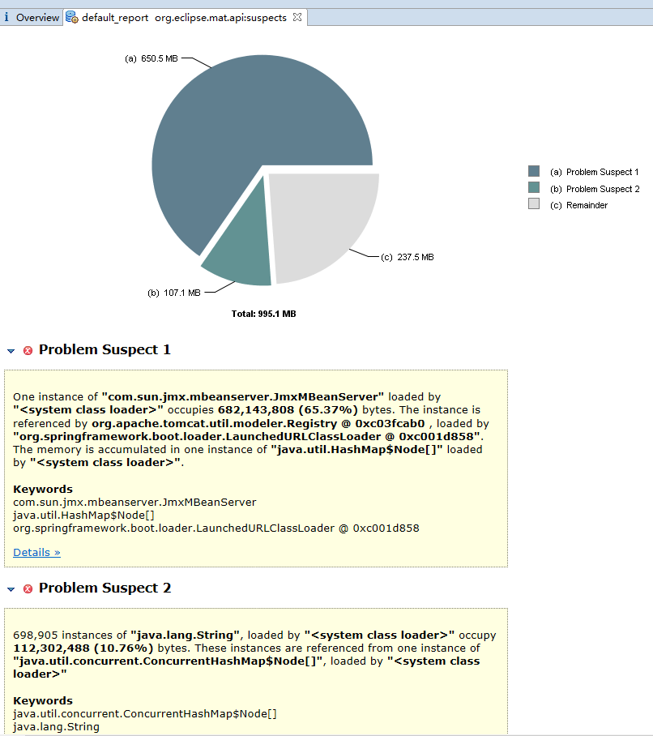
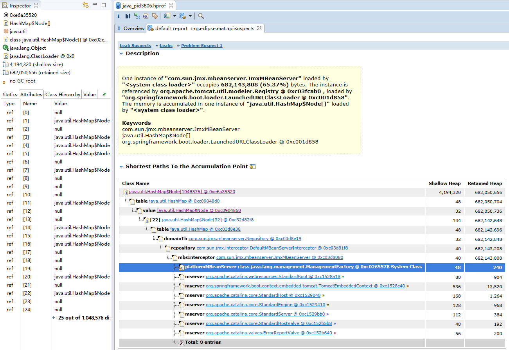
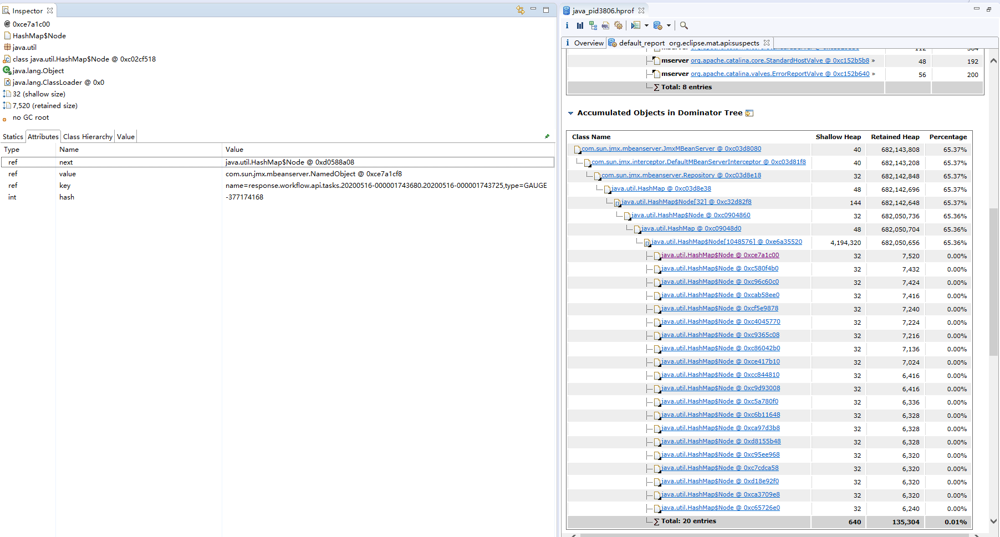
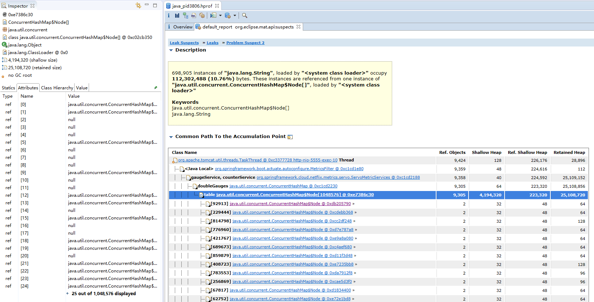
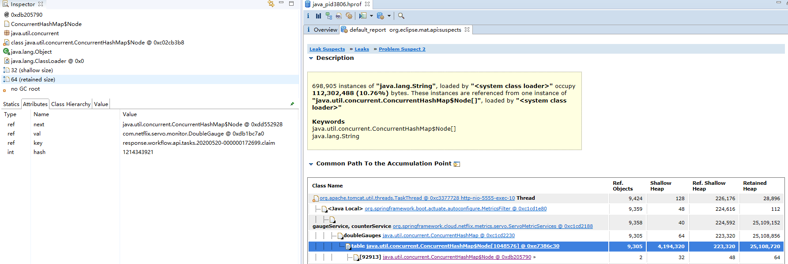

# Java命令——jmap
jmap是java虚拟机自带的一种内存映像工具

jmap命令用于生成堆转储快照，有时候也成为heapdump或者dump文件。

jmap不仅仅可以获取dump文件，还可以查询finalize执行队列，Java堆和永久代的详细信息，如空间使用率、当时用的是那种收集器等。
## 命令详解
```
[root@iZbp12ureidz7tsw2oabgtZ bin]# ./jmap --help
Usage:
    jmap [option] <pid>
        (to connect to running process)
    jmap [option] <executable <core>
        (to connect to a core file)
    jmap [option] [server_id@]<remote server IP or hostname>
        (to connect to remote debug server)

where <option> is one of:
    <none>               to print same info as Solaris pmap
    -heap                to print java heap summary
    -histo[:live]        to print histogram of java object heap; if the "live"
                         suboption is specified, only count live objects
    -clstats             to print class loader statistics
    -finalizerinfo       to print information on objects awaiting finalization
    -dump:<dump-options> to dump java heap in hprof binary format
                         dump-options:
                           live         dump only live objects; if not specified,
                                        all objects in the heap are dumped.
                           format=b     binary format
                           file=<file>  dump heap to <file>
                         Example: jmap -dump:live,format=b,file=heap.bin <pid>
    -F                   force. Use with -dump:<dump-options> <pid> or -histo
                         to force a heap dump or histogram when <pid> does not
                         respond. The "live" suboption is not supported
                         in this mode.
    -h | -help           to print this help message
    -J<flag>             to pass <flag> directly to the runtime system
```
示例：
```
jmap -dump:live,format=b,file=jmap.hprof [pid]
jmap -F -dump:format=b,file=jmap.hprof [pid] 
```
以上可以在jvm还运行的时候进行导出，有可能出现程序运行过程中内存溢出导致程序飞掉，那么就拿不到dump文件了，可以尝试添加jvm参数运行过程中出现内存溢出进行导出
## JVM参数，内存溢出生成dump文件
```
-XX:+HeapDumpOnOutOfMemoryError -XX:HeapDumpPath=[输出目录]
```
## 分析一次内存溢出的过程
线上有一个系统，网关隔一段时间就会出现内存溢出，照理说网关除了做路由转发，没干其他什么事情，没什么道理才对
### 问题表现
1. 接口响应超时
2. `jstat -gc [pid] 1000`查看发现full gc频繁，OC和OU相近，同时接近设置的最大堆`-Xmx`
3. 存在内存溢出生成的dump文件

### 分析dump
通过eclipse插件MAT加载dump文件



通过工具分析，发现两个可疑点，点击详情分别查看
#### 可疑点1



可以看到存在一个庞大的`java.util.HashMap`，然后东西存在`com.sun.jmx.mbeanserver.JmxMBeanServer`类下，通过网上的资料了解到`JmxMBeanServer`是和`jmx`有关系，猜测是和监控之类的内容有关

然后再看`HashMap`里面存的什么，如图，里面是以`name=response.workflow.api.tasks.20200516-000001743680.20200516-000001743725,type=GAUGE`或`name=response.workflow.api.tasks.20200517-000000346781.claim,type=GAUGE`为key，value是`com.sun.jmx.mbeanserver.NamedObject`对象

仔细看key，发现貌似和工作流的API接口有关系我们看下代码
```java
// 简化类内容
// 接口地址：http://ip:port/ccrm/workflow/api/tasks/{processInstanceId}/{taskId}?jobNumber=
//          http://ip:port/ccrm/workflow/api/tasks/{taskId}/{type}?jobNumber=
@RestController
@RequestMapping("/api")
public class ApiOuterController extends BaseController {
    @GetMapping("/tasks/{processInstanceId}/{taskId}")
    public ResultVO getTask(@PathVariable("processInstanceId") String processInstanceId, @PathVariable("taskId") String taskId,
                            @RequestParam("jobNumber") String jobNumber, HttpServletRequest request) {
        return workTaskService.getTask(processInstanceId, taskId, getUserDTO(jobNumber, request));
    }

    @PatchMapping("/tasks/{taskId}/{type}")
    public ResultVO assignedTask(@Valid @RequestBody TaskDTO taskDTO,
                                 @PathVariable("taskId") String taskId, @PathVariable("type") String type,
                                 @RequestParam("jobNumber") String jobNumber, HttpServletRequest request) {
    }
}
```
这两个接口和两个key遥相呼应，我们接下去看可疑点2
#### 可疑点2



这里存在一个`java.util.concurrent.ConcurrentHashMap`，东西存在`org.springframework.boot.actuate.autoconfigure.MetricsFilter`下，里面存的内容是`com.netflix.servo.monitor.DoubleGauge`

然后很神奇的发现，`ConcurrentHashMap`的数量和`HashMap`的是一样的，或许是巧合，不过看到下面的内容就感觉不是巧合了

`ConcurrentHashMap`的key是`response.workflow.api.tasks.20200520-000000172699.claim`或`response.workflow.api.tasks.20200516-000000519083.20200516-000000519128`和上面的很像是不是，怀疑他们是成对设置进去的，下面看下代码切入点`MetricsFilter`和`ServoMetricServices`

```java
@Order(Ordered.HIGHEST_PRECEDENCE)
final class MetricsFilter extends OncePerRequestFilter {
    private void submitMetrics(MetricsFilterSubmission submission,
            HttpServletRequest request, int status, long time, String suffix) {
        String prefix = "";
        if (submission == MetricsFilterSubmission.PER_HTTP_METHOD) {
            prefix = request.getMethod() + ".";
        }
        if (this.properties.shouldSubmitToGauge(submission)) {
            submitToGauge(getKey("response." + prefix + suffix), time);
        }
        if (this.properties.shouldSubmitToCounter(submission)) {
            incrementCounter(getKey("status." + prefix + status + suffix));
        }
    }

    private void submitToGauge(String metricName, double value) {
        try {
            this.gaugeService.submit(metricName, value);
        }
        catch (Exception ex) {
            logger.warn("Unable to submit gauge metric '" + metricName + "'", ex);
        }
    }
}

public class ServoMetricServices implements CounterService, GaugeService {
    private final MonitorRegistry registry;
    private final ConcurrentMap<String, DoubleGauge> doubleGauges = new ConcurrentHashMap<>();
    @Override
    public void submit(String name, double dValue) {
        long value = ((Double) dValue).longValue();
        String strippedName = stripMetricName(name);
        if (name.startsWith("histogram.")) {
            BasicDistributionSummary distributionSummary = distributionSummaries
                    .get(strippedName);
            if (distributionSummary == null) {
                distributionSummary = new BasicDistributionSummary(MonitorConfig.builder(
                        strippedName).build());
                distributionSummaries.put(strippedName, distributionSummary);
                registry.register(distributionSummary);
            }
            distributionSummary.record(value);
        }
        else if (name.startsWith("timer.")) {
            BasicTimer timer = timers.get(strippedName);
            if (timer == null) {
                timer = new BasicTimer(MonitorConfig.builder(strippedName).build());
                timers.put(strippedName, timer);
                registry.register(timer);
            }
            timer.record(value, TimeUnit.MILLISECONDS);
        }
        else {
            DoubleGauge gauge = doubleGauges.get(strippedName);
            if (gauge == null) {
                gauge = new DoubleGauge(MonitorConfig.builder(strippedName).build());
                doubleGauges.put(strippedName, gauge);
                registry.register(gauge);
            }
            gauge.set(dValue);
        }
    }
}
```
限于篇幅，截取部分代码，很幸运的发现`submitMetrics`方法有一个扎眼的关键字`response.`，顺藤摸瓜`submit`方法和我们预期的有点接近，最终put到`ConcurrentHashMap`和`HashMap`

然后为什么会这样，一把有效的利器`打断点`，无疑，问题找到了就是因为接口的url地址存在路径参数，每个工单是路径参数都是不一样的，个把月下来map的数量真不是盖的

回归到问题的源头，目前内存溢出的是`gateway`，那么应用`workflow`为什么没问题呢？？？

他们的关系很简单，无非`gateway`通过`zuul`路由转发到`workflow`，再次打断点，发现workflow跑同样过滤器代码，那个key竟然是`response.workflow.api.tasks.processInstanceId.taskId`和`response.workflow.api.tasks.taskId.type`，那么问题清楚了，`gateway`不知道那个是路径参数，所以记录了实际的url地址，而`workflow`有具体的controller类知道那个是路径参数定义所以记录的是通用的地址再多的工单也就两条记录
### 解决问题
网关层，禁用MetricsFilter即可
```java
@Configuration
@ConditionalOnBean({ CounterService.class, GaugeService.class })
@ConditionalOnClass({ Servlet.class, ServletRegistration.class,
        OncePerRequestFilter.class, HandlerMapping.class })
@AutoConfigureAfter(MetricRepositoryAutoConfiguration.class)
@ConditionalOnProperty(prefix = "endpoints.metrics.filter", name = "enabled", matchIfMissing = true)
@EnableConfigurationProperties({ MetricFilterProperties.class })
public class MetricFilterAutoConfiguration {

    private final CounterService counterService;

    private final GaugeService gaugeService;

    private final MetricFilterProperties properties;

    public MetricFilterAutoConfiguration(CounterService counterService,
            GaugeService gaugeService, MetricFilterProperties properties) {
        this.counterService = counterService;
        this.gaugeService = gaugeService;
        this.properties = properties;
    }

    @Bean
    public MetricsFilter metricsFilter() {
        return new MetricsFilter(this.counterService, this.gaugeService, this.properties);
    }

}
```
通过代码，发现MetricsFilter的创建有一定条件，就是endpoints.metrics.filter.enabled需要为true，默认就是true，我们将配置调整改为false
```YMAL
endpoints:
  metrics:
    filter:
      enabled: false
```
再次通过断点验证，发现那个`MetricsFilter`过滤器已经不再执行了，问题圆满结束

有没有好奇监控的是什么内容呢，怎么样才能看到监控的内容呢，请继续往下看
### 刨根究底-延伸解读
本项目是spring boot 1.5.10.RELEASE+spring could Dalston.SR3，涉及的内容和spring boot 2.x可能有差距
```xml
        <dependency>
            <groupId>org.springframework.boot</groupId>
            <artifactId>spring-boot-starter-actuator</artifactId>
        </dependency>
```
监控内容是因为项目引入了以上模块

#### 如何查看监控内容
默认情况通过`http://ip:port/info`查看

有哪些内容可以查看呢

HTTP|方法|路径|描述
---|---|---|---
GET|/autoconfig |提供了一份自动配置报告，记录哪些自动配置条件通过了，哪些没通过
GET |/configprops  |  描述配置属性(包含默认值)如何注入Bean
GET |/beans | 描述应用程序上下文里全部的Bean，以及它们的关系
GET |/dump |  获取线程活动的快照
GET |/env  |  获取全部环境属性
GET |/env/{name}| 根据名称获取特定的环境属性值
GET |/health |报告应用程序的健康指标，这些值由HealthIndicator的实现类提供
GET |/info  | 获取应用程序的定制信息，这些信息由info打头的属性提供
GET |/mappings |  描述全部的URI路径，以及它们和控制器(包含Actuator端点)的映射关系
GET |/metrics   | 报告各种应用程序度量信息，比如内存用量和HTTP请求计数
GET |/metrics/{name} |报告指定名称的应用程序度量值
POST |   /shutdown |  关闭应用程序，要求endpoints.shutdown.enabled设置为true
GET |/trace|  提供基本的HTTP请求跟踪信息(时间戳、HTTP头等)

其中`http://ip:port/metrics`就可以看到前面导致内存溢出的监控内容

由于当前项目对请求做了拦截用于记录日志，针对以上的众多接口不希望单独配置忽略拦截，希望有一个统一的路径可以一并处理
```YAML
management:
  security:
    enabled: false
  context-path: /cloud-monitor
```
通过以上配置，请求地址就变成了`http://ip:port/cloud-monitor/metrics`

为了保证 actuator 暴露的监控接口的安全性，需要添加安全控制的依赖spring-boot-start-security依赖，访问应用监控端点时，都需要输入验证信息。Security 依赖，可以选择不加，不进行安全管理，但不建议这么做。

以上针对一般应用确实是这样的，那么对于网关是不是这样的呢，其实没太大区别，只是本项目由于历史原因走了点弯路，看网关配置
```YAML
server:
  port: 15555
  context-path: /ccrm
zuul:
  host:
    connect-timeout-millis: 2000
    socket-timeout-millis: 30000
    max-per-route-connections: 500
    max-total-connections: 1000
  routes:
    module-service: /module/**
  servlet-path: /
  sensitive-headers:
endpoints:
  metrics:
    filter:
      enabled: false
```
为了防止跨域，后端网关和前端项目代理到同一个nginx下，网关层增加了上下文`/ccrm`

我们一般的业务接口http://ip:port/ccrm/module/a/b

根据配置，所有`/ccrm`下的内容都会被`zuul`路由转发到业务模块，根据监控地址应该是`http://ip:port/ccrm/cloud-monitor/metrics`，最终会出现异常，提示路由不存在`No route found for uri: /cloud-monitor/metrics`，

正确的做法是设置`zuul.servlet-path=/ccrm`，而`server.context-path`设置为空，当然如果是新项目这个也可以有值，这样监控地址就是`http://ip:port/cloud-monitor/metrics`，相当于将路由和监控的路径彻底分开

## 总结
问题解决起来还算顺利，出现以上这些问题，主要还是对spring boot和spring could框架研究的不够深入，然后版本的差异，网上找资料是走了一些弯路