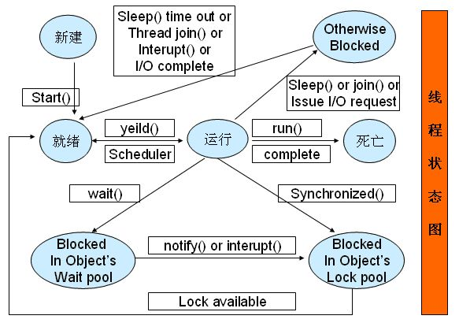
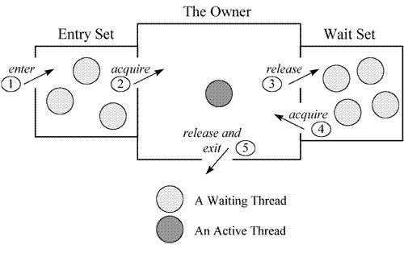

# Java命令——jstack
jstack是JDK里面自带的工具，可以通过该工具查看Java进程执行情况，显示出具体线程堆栈信息，据了解也可以分析core文件（目前没有使用过），本文讲的都是分析Java进程

## 命令详解
```
jstack.exe --help
Usage:
    jstack [-l] <pid>
    进程还没有挂，使用该命令需要一个pid（Java进程ID）
        (to connect to running process)
    jstack -F [-m] [-l] <pid>
    进程挂了，使用参数强制输出
        (to connect to a hung process)
    jstack [-m] [-l] <executable> <core>
    分析一个core文件
        (to connect to a core file)
    jstack [-m] [-l] [server_id@]<remote server IP or hostname>
    连接到远程主机，输出服务器的进程信息
        (to connect to a remote debug server)

Options:
    -F  to force a thread dump. Use when jstack <pid> does not respond (process is hung)
    如果Java进程没有响应可以使用该参数，强制输出
    -m  to print both java and native frames (mixed mode)
    混合模式，将输出包括本地方法栈信息
    -l  long listing. Prints additional information about locks
    更详细的清单，附加锁信息
    -h or -help to print this help message
    帮助
```
## jstack输出详解
```java
public class JstackOut {
    public static void main(String[] args) {
        while (true) ;
    }
}
```
运行后获取线程堆栈信息
```
[root@hsipcc opt]# jstack 12175
2018-07-26 15:32:49
Full thread dump Java HotSpot(TM) 64-Bit Server VM (25.144-b01 mixed mode):

"Attach Listener" #9 daemon prio=9 os_prio=0 tid=0x00007f0fb8001000 nid=0x3849 waiting on condition [0x0000000000000000]
   java.lang.Thread.State: RUNNABLE

"Service Thread" #8 daemon prio=9 os_prio=0 tid=0x00007f0ff40c6800 nid=0x3834 runnable [0x0000000000000000]
   java.lang.Thread.State: RUNNABLE

"C1 CompilerThread2" #7 daemon prio=9 os_prio=0 tid=0x00007f0ff40bb800 nid=0x3833 waiting on condition [0x0000000000000000]
   java.lang.Thread.State: RUNNABLE

"C2 CompilerThread1" #6 daemon prio=9 os_prio=0 tid=0x00007f0ff40b9800 nid=0x3832 waiting on condition [0x0000000000000000]
   java.lang.Thread.State: RUNNABLE

"C2 CompilerThread0" #5 daemon prio=9 os_prio=0 tid=0x00007f0ff40b6800 nid=0x3831 waiting on condition [0x0000000000000000]
   java.lang.Thread.State: RUNNABLE

"Signal Dispatcher" #4 daemon prio=9 os_prio=0 tid=0x00007f0ff40b5800 nid=0x3830 runnable [0x0000000000000000]
   java.lang.Thread.State: RUNNABLE

"Finalizer" #3 daemon prio=8 os_prio=0 tid=0x00007f0ff4082800 nid=0x382f in Object.wait() [0x00007f0fdec6e000]
   java.lang.Thread.State: WAITING (on object monitor)
    at java.lang.Object.wait(Native Method)
    - waiting on <0x000000076ce08ec8> (a java.lang.ref.ReferenceQueue$Lock)
    at java.lang.ref.ReferenceQueue.remove(ReferenceQueue.java:143)
    - locked <0x000000076ce08ec8> (a java.lang.ref.ReferenceQueue$Lock)
    at java.lang.ref.ReferenceQueue.remove(ReferenceQueue.java:164)
    at java.lang.ref.Finalizer$FinalizerThread.run(Finalizer.java:209)

"Reference Handler" #2 daemon prio=10 os_prio=0 tid=0x00007f0ff407e000 nid=0x382e in Object.wait() [0x00007f0fded6f000]
   java.lang.Thread.State: WAITING (on object monitor)
    at java.lang.Object.wait(Native Method)
    - waiting on <0x000000076ce06b68> (a java.lang.ref.Reference$Lock)
    at java.lang.Object.wait(Object.java:502)
    at java.lang.ref.Reference.tryHandlePending(Reference.java:191)
    - locked <0x000000076ce06b68> (a java.lang.ref.Reference$Lock)
    at java.lang.ref.Reference$ReferenceHandler.run(Reference.java:153)

"main" #1 prio=5 os_prio=0 tid=0x00007f0ff4008800 nid=0x3828 runnable [0x00007f0ffa047000]
   java.lang.Thread.State: RUNNABLE
    at jvm.jstack.JstackOut.main(JstackOut.java:25)

"VM Thread" os_prio=0 tid=0x00007f0ff4076000 nid=0x382d runnable 

"GC task thread#0 (ParallelGC)" os_prio=0 tid=0x00007f0ff401d800 nid=0x3829 runnable 

"GC task thread#1 (ParallelGC)" os_prio=0 tid=0x00007f0ff401f000 nid=0x382a runnable 

"GC task thread#2 (ParallelGC)" os_prio=0 tid=0x00007f0ff4021000 nid=0x382b runnable 

"GC task thread#3 (ParallelGC)" os_prio=0 tid=0x00007f0ff4022800 nid=0x382c runnable 

"VM Periodic Task Thread" os_prio=0 tid=0x00007f0ff40c9800 nid=0x3835 waiting on condition 

JNI global references: 6
```
其中
```
"main" #1 prio=5 os_prio=0 tid=0x00007f0ff4008800 nid=0x3828 runnable [0x00007f0ffa047000]
   java.lang.Thread.State: RUNNABLE
    at jvm.jstack.JstackOut.main(JstackOut.java:25)
```
就是一个线程堆栈信息

`"main"`：线程名称，如果使用线程池的话，一般要求自定义一个线程名，以便排查问题

nid：native线程的id，他可以通过linux命令：`ps -mp pid -o THREAD,tid,time`可以找到一个Java进程所有的线程，包含CPU使用情况，线程ID，将命令得到的线程ID从十进制转换成十六进制，可以得到nid

java.lang.Thread.State：线程状态，初始`NEW`运行`RUNNABLE`阻塞`BLOCKED`等待`WAITING`超时等待`TIME_WAITING`终止`TERMINATED`

runnable：标识当前处于什么状态

at：展示的就是线程执行堆栈，当前执行到哪一行
## 能做什么
### 检查死锁
写一段实例代码产生死锁
```java
public class JstackOut {

    Object a = new Object();
    Object b = new Object();

    public static void main(String[] args) {
        new JstackOut().deadlock();
        while (true) ;
    }

    private void deadlock() {
        for (int i = 0; i < 1; i++) {

            Thread threadA = new Thread(() -> {
                Thread.currentThread().setName("thread a");
                synchronized (a) {
                    try {
                        Thread.sleep(500);
                    } catch (InterruptedException e) {
                        e.printStackTrace();
                    }
                    synchronized (b) {
                        try {
                            Thread.sleep(500);
                        } catch (InterruptedException e) {
                            e.printStackTrace();
                        }
                    }
                }

            });

            Thread threadB = new Thread(() -> {
                Thread.currentThread().setName("thread b");
                synchronized (b) {
                    try {
                        Thread.sleep(500);
                    } catch (InterruptedException e) {
                        e.printStackTrace();
                    }
                    synchronized (a) {
                        try {
                            Thread.sleep(500);
                        } catch (InterruptedException e) {
                            e.printStackTrace();
                        }
                    }
                }
            });
            threadA.start();
            threadB.start();
        }
    }
}
```
通过命令可以获取内容
```
"thread b" #10 prio=5 os_prio=0 tid=0x00007f2350161000 nid=0x6def waiting for monitor entry [0x00007f233cfba000]
   java.lang.Thread.State: BLOCKED (on object monitor)
    at jvm.jstack.JstackOut.lambda$deadlock$4(JstackOut.java:89)
    - waiting to lock <0x000000076ce5f028> (a java.lang.Object)
    - locked <0x000000076ce5f038> (a java.lang.Object)
    at jvm.jstack.JstackOut$$Lambda$2/531885035.run(Unknown Source)
    at java.lang.Thread.run(Thread.java:748)

"thread a" #9 prio=5 os_prio=0 tid=0x00007f235015f800 nid=0x6dee waiting for monitor entry [0x00007f233d0bb000]
   java.lang.Thread.State: BLOCKED (on object monitor)
    at jvm.jstack.JstackOut.lambda$deadlock$3(JstackOut.java:70)
    - waiting to lock <0x000000076ce5f038> (a java.lang.Object)
    - locked <0x000000076ce5f028> (a java.lang.Object)
    at jvm.jstack.JstackOut$$Lambda$1/834600351.run(Unknown Source)
    at java.lang.Thread.run(Thread.java:748)

Found one Java-level deadlock:
=============================
"thread b":
  waiting to lock monitor 0x00007f22ec002178 (object 0x000000076ce5f028, a java.lang.Object),
  which is held by "thread a"
"thread a":
  waiting to lock monitor 0x00007f23140062c8 (object 0x000000076ce5f038, a java.lang.Object),
  which is held by "thread b"

Java stack information for the threads listed above:
===================================================
"thread b":
    at jvm.jstack.JstackOut.lambda$deadlock$4(JstackOut.java:89)
    - waiting to lock <0x000000076ce5f028> (a java.lang.Object)
    - locked <0x000000076ce5f038> (a java.lang.Object)
    at jvm.jstack.JstackOut$$Lambda$2/531885035.run(Unknown Source)
    at java.lang.Thread.run(Thread.java:748)
"thread a":
    at jvm.jstack.JstackOut.lambda$deadlock$3(JstackOut.java:70)
    - waiting to lock <0x000000076ce5f038> (a java.lang.Object)
    - locked <0x000000076ce5f028> (a java.lang.Object)
    at jvm.jstack.JstackOut$$Lambda$1/834600351.run(Unknown Source)
    at java.lang.Thread.run(Thread.java:748)

Found 1 deadlock.
```
通过代码线程`thread a`持有锁0x000000076ce5f028，等待锁0x000000076ce5f038，而线程`thread b`持有锁0x000000076ce5f038，等待锁0x000000076ce5f028，导致两个线程相互等待对方的锁资源释放，从而导致死锁问题
### 线程池定位线程
看下使用线程池创建线程，堆栈信息如何显示
```java
public class JstackOut {

    Object a = new Object();
    Object b = new Object();

    public static void main(String[] args) {
        threadPool();
        while (true) ;
    }

    private static void threadPool() {
        Executor executor = Executors.newFixedThreadPool(4);
        executor.execute(() -> Thread.currentThread().setName("thread pool 1"));
        executor.execute(() -> {
        });
    }
}
```
堆栈信息
```
"pool-1-thread-2" #11 prio=5 os_prio=0 tid=0x00007ff5c41a1000 nid=0x6f20 waiting on condition [0x00007ff5ae042000]
   java.lang.Thread.State: WAITING (parking)
	at sun.misc.Unsafe.park(Native Method)
	- parking to wait for  <0x000000076ce611a8> (a java.util.concurrent.locks.AbstractQueuedSynchronizer$ConditionObject)
	at java.util.concurrent.locks.LockSupport.park(LockSupport.java:175)
	at java.util.concurrent.locks.AbstractQueuedSynchronizer$ConditionObject.await(AbstractQueuedSynchronizer.java:2039)
	at java.util.concurrent.LinkedBlockingQueue.take(LinkedBlockingQueue.java:442)
	at java.util.concurrent.ThreadPoolExecutor.getTask(ThreadPoolExecutor.java:1074)
	at java.util.concurrent.ThreadPoolExecutor.runWorker(ThreadPoolExecutor.java:1134)
	at java.util.concurrent.ThreadPoolExecutor$Worker.run(ThreadPoolExecutor.java:624)
	at java.lang.Thread.run(Thread.java:748)

"thread pool 1" #10 prio=5 os_prio=0 tid=0x00007ff5c419d000 nid=0x6f1f waiting on condition [0x00007ff5ae143000]
   java.lang.Thread.State: WAITING (parking)
	at sun.misc.Unsafe.park(Native Method)
	- parking to wait for  <0x000000076ce611a8> (a java.util.concurrent.locks.AbstractQueuedSynchronizer$ConditionObject)
	at java.util.concurrent.locks.LockSupport.park(LockSupport.java:175)
	at java.util.concurrent.locks.AbstractQueuedSynchronizer$ConditionObject.await(AbstractQueuedSynchronizer.java:2039)
	at java.util.concurrent.LinkedBlockingQueue.take(LinkedBlockingQueue.java:442)
	at java.util.concurrent.ThreadPoolExecutor.getTask(ThreadPoolExecutor.java:1074)
	at java.util.concurrent.ThreadPoolExecutor.runWorker(ThreadPoolExecutor.java:1134)
	at java.util.concurrent.ThreadPoolExecutor$Worker.run(ThreadPoolExecutor.java:624)
	at java.lang.Thread.run(Thread.java:748)

"main" #1 prio=5 os_prio=0 tid=0x00007ff5c4008800 nid=0x6f10 runnable [0x00007ff5c9c9e000]
   java.lang.Thread.State: RUNNABLE
	at jvm.jstack.JstackOut.main(JstackOut.java:24)

```
其中`thread pool 1`自定定义了线程名，`pool-1-thread-2`是默认的线程名

当碰到默认的线程名，特别是当前的线程任务已经执行完毕等待后续任务`java.lang.Thread.State: WAITING (parking)`，那将很难排查这个线程是哪里创建的，如果线程数多起来将无法定位问题，所以一般要求需要自定义下线程名，同时创建线程池的时候指定下`ThreadFactory`，里面可以自定义线程名创建方式可以参考`Executors.defaultThreadFactory()`
### CPU使用过高定位
上面的例子中我们通过命令看下线程的CPU使用率
[root@hsipcc opt]# ps -mp $pid -o THREAD,tid,time

USER|%CPU|PRI|SCNT|WCHAN|USER|SYSTEM|TID|TIME
---|---|---|---|---|---|---|---|---
root|99.8|-|-|-|-|-|-|00:22:54
root|99.8|19|-|-|-|-|28432|00:22:53

可以看到其中线程号28432占用的CPU高达99.8%，那么我们定位下，通过计算器计算28432的十六进制结果是0x6f10，那么我们找下是那个线程堆栈发现是
```
"main" #1 prio=5 os_prio=0 tid=0x00007ff5c4008800 nid=0x6f10 runnable [0x00007ff5c9c9e000]
   java.lang.Thread.State: RUNNABLE
    at jvm.jstack.JstackOut.main(JstackOut.java:24)
```
查看下具体代码，发现有一个死循环`while (true);`
### 线程运行分析
线程状态有以下几种：

1. 初始(NEW)
> 新创建了一个线程对象，但还没有调用start()方法。
2. 运行(RUNNABLE)
> Java线程中将就绪（ready）和运行中（running）两种状态笼统的成为“运行”。
线程对象创建后，其他线程(比如main线程）调用了该对象的start()方法。该状态的线程位于可运行线程池中，等待被线程调度选中，获取cpu 的使用权，此时处于就绪状态（ready）。就绪状态的线程在获得cpu 时间片后变为运行中状态（running）。
3. 阻塞(BLOCKED)
> 表线程阻塞于锁。
4. 等待(WAITING)
> 进入该状态的线程需要等待其他线程做出一些特定动作（通知或中断）。
5. 超时等待(TIME_WAITING)
> 该状态不同于WAITING，它可以在指定的时间内自行返回。
6. 终止(TERMINATED)
> 表示该线程已经执行完毕。



其中RUNNABLE，BLOCKED，WAITING，TIME_WAITING四种状态是最常见的，RUNNABLE就是运行中，上面的例子也看了很多，下面看下其他状态什么时候产生：

看一个等待锁的实例
```java
public class JstackOut {

    Object a = new Object();
    Lock lock = new ReentrantLock();

    public static void main(String[] args) throws InterruptedException {
        new JstackOut().waitingLock1();
        new JstackOut().waitingLock2();
        while (true) ;
    }

    private void waitingLock1() throws InterruptedException {
        new Thread(() -> {
            Thread.currentThread().setName("lock thread1");
            lock.lock();
            while (true) ;
        }).start();

        Thread.sleep(500);

        new Thread(() -> {
            Thread.currentThread().setName("lock thread2");
            lock.lock();
        }).start();
    }

    private void waitingLock2() throws InterruptedException {
        new Thread(() -> {
            Thread.currentThread().setName("synchronized thread1");
            synchronized (a) {
                while (true) ;
            }
        }).start();

        Thread.sleep(500);

        new Thread(() -> {
            Thread.currentThread().setName("synchronized thread2");
            synchronized (a) {
            }
        }).start();
    }
}
```
对应的堆栈信息
```
"synchronized thread2" #12 prio=5 os_prio=0 tid=0x00007f3300185800 nid=0x7555 waiting for monitor entry [0x00007f32ebcfb000]
   java.lang.Thread.State: BLOCKED (on object monitor)
    at jvm.jstack.JstackOut.lambda$waitingLock2$5(JstackOut.java:66)
    - waiting to lock <0x000000076d0f63d0> (a java.lang.Object)
    at jvm.jstack.JstackOut$$Lambda$4/142257191.run(Unknown Source)
    at java.lang.Thread.run(Thread.java:748)

"synchronized thread1" #11 prio=5 os_prio=0 tid=0x00007f3300183800 nid=0x7554 runnable [0x00007f32ebdfc000]
   java.lang.Thread.State: RUNNABLE
    at jvm.jstack.JstackOut.lambda$waitingLock2$4(JstackOut.java:57)
    - locked <0x000000076d0f63d0> (a java.lang.Object)
    at jvm.jstack.JstackOut$$Lambda$3/135721597.run(Unknown Source)
    at java.lang.Thread.run(Thread.java:748)

"lock thread2" #10 prio=5 os_prio=0 tid=0x00007f3300181800 nid=0x7553 waiting on condition [0x00007f32ebefd000]
   java.lang.Thread.State: WAITING (parking)
    at sun.misc.Unsafe.park(Native Method)
    - parking to wait for  <0x000000076ce60930> (a java.util.concurrent.locks.ReentrantLock$NonfairSync)
    at java.util.concurrent.locks.LockSupport.park(LockSupport.java:175)
    at java.util.concurrent.locks.AbstractQueuedSynchronizer.parkAndCheckInterrupt(AbstractQueuedSynchronizer.java:836)
    at java.util.concurrent.locks.AbstractQueuedSynchronizer.acquireQueued(AbstractQueuedSynchronizer.java:870)
    at java.util.concurrent.locks.AbstractQueuedSynchronizer.acquire(AbstractQueuedSynchronizer.java:1199)
    at java.util.concurrent.locks.ReentrantLock$NonfairSync.lock(ReentrantLock.java:209)
    at java.util.concurrent.locks.ReentrantLock.lock(ReentrantLock.java:285)
    at jvm.jstack.JstackOut.lambda$waitingLock1$3(JstackOut.java:49)
    at jvm.jstack.JstackOut$$Lambda$2/303563356.run(Unknown Source)
    at java.lang.Thread.run(Thread.java:748)

"lock thread1" #9 prio=5 os_prio=0 tid=0x00007f330017f800 nid=0x7552 runnable [0x00007f32ebffe000]
   java.lang.Thread.State: RUNNABLE
    at jvm.jstack.JstackOut.lambda$waitingLock1$2(JstackOut.java:42)
    at jvm.jstack.JstackOut$$Lambda$1/531885035.run(Unknown Source)
    at java.lang.Thread.run(Thread.java:748)

"main" #1 prio=5 os_prio=0 tid=0x00007fb1c4008800 nid=0x73a2 runnable [0x00007fb1ca89f000]
   java.lang.Thread.State: RUNNABLE
    at jvm.jstack.JstackOut.main(JstackOut.java:28)
```
通过代码可以分析出来，线程`lock thread1`和`synchronized thread1`先拿到锁，然不停的执行

线程`synchronized thread2`和`lock thread2`等待锁资源，从堆栈信息可以看出不同的加锁方式等待锁的信息是有区别的

等待synchronized关键字锁是显示`BLOCKED (on object monitor)`，等待ReentrantLock锁是显示`WAITING (parking)`

再看线程等待的几种情况
```java
public class JstackOut {
    Object b = new Object();

    public static void main(String[] args) throws InterruptedException {
        new JstackOut().waiting();
        while (true) ;
    }

    private void waiting() throws InterruptedException {
        new Thread(() -> {
            Thread.currentThread().setName("sleep thread");
            try {
                Thread.sleep(60 * 1000);
            } catch (InterruptedException e) {
                e.printStackTrace();
            }
        }).start();

        new Thread(() -> {
            Thread.currentThread().setName("wait thread");
            synchronized (a) {
                try {
                    a.wait();
                } catch (InterruptedException e) {
                    e.printStackTrace();
                }
            }
        }).start();

        new Thread(() -> {
            Thread.currentThread().setName("wait time thread");
            synchronized (a) {
                try {
                    a.wait(60 * 1000);
                } catch (InterruptedException e) {
                    e.printStackTrace();
                }
            }
        }).start();

        Thread.currentThread().join(10 * 1000);
        Thread.currentThread().join();
    }
```
这个例子的输出有种表现前10秒
```
"wait time thread" #11 prio=5 os_prio=0 tid=0x00007f1bd817c000 nid=0x7659 in Object.wait() [0x00007f1bc3bfa000]
   java.lang.Thread.State: TIMED_WAITING (on object monitor)
    at java.lang.Object.wait(Native Method)
    - waiting on <0x000000076ce5f990> (a java.lang.Object)
    at jvm.jstack.JstackOut.lambda$waiting$4(JstackOut.java:65)
    - locked <0x000000076ce5f990> (a java.lang.Object)
    at jvm.jstack.JstackOut$$Lambda$3/1826771953.run(Unknown Source)
    at java.lang.Thread.run(Thread.java:748)

"wait thread" #10 prio=5 os_prio=0 tid=0x00007f1bd817a000 nid=0x7658 in Object.wait() [0x00007f1bc3cfb000]
   java.lang.Thread.State: WAITING (on object monitor)
    at java.lang.Object.wait(Native Method)
    - waiting on <0x000000076ce5f990> (a java.lang.Object)
    at java.lang.Object.wait(Object.java:502)
    at jvm.jstack.JstackOut.lambda$waiting$3(JstackOut.java:54)
    - locked <0x000000076ce5f990> (a java.lang.Object)
    at jvm.jstack.JstackOut$$Lambda$2/142257191.run(Unknown Source)
    at java.lang.Thread.run(Thread.java:748)

"sleep thread" #9 prio=5 os_prio=0 tid=0x00007f1bd8177800 nid=0x7657 waiting on condition [0x00007f1bc3dfc000]
   java.lang.Thread.State: TIMED_WAITING (sleeping)
    at java.lang.Thread.sleep(Native Method)
    at jvm.jstack.JstackOut.lambda$waiting$2(JstackOut.java:44)
    at jvm.jstack.JstackOut$$Lambda$1/531885035.run(Unknown Source)
    at java.lang.Thread.run(Thread.java:748)

"main" #1 prio=5 os_prio=0 tid=0x00007f1bd8008800 nid=0x7649 in Object.wait() [0x00007f1bdf91e000]
   java.lang.Thread.State: TIMED_WAITING (on object monitor)
    at java.lang.Object.wait(Native Method)
    - waiting on <0x000000076ce05ca0> (a java.lang.Thread)
    at java.lang.Thread.join(Thread.java:1260)
    - locked <0x000000076ce05ca0> (a java.lang.Thread)
    at jvm.jstack.JstackOut.waiting(JstackOut.java:72)
    at jvm.jstack.JstackOut.main(JstackOut.java:29)
```
10秒后主要是main线程的变化
```
"main" #1 prio=5 os_prio=0 tid=0x00007f1bd8008800 nid=0x7649 in Object.wait() [0x00007f1bdf91e000]
   java.lang.Thread.State: WAITING (on object monitor)
    at java.lang.Object.wait(Native Method)
    - waiting on <0x000000076ce05ca0> (a java.lang.Thread)
    at java.lang.Thread.join(Thread.java:1252)
    - locked <0x000000076ce05ca0> (a java.lang.Thread)
    at java.lang.Thread.join(Thread.java:1326)
    at jvm.jstack.JstackOut.waiting(JstackOut.java:73)
    at jvm.jstack.JstackOut.main(JstackOut.java:29)
```
结合代码和线程堆栈可以比较明显的看出他们的对应关系

1. `sleep()`：TIMED_WAITING (sleeping)
2. `wait()，join()`：WAITING (on object monitor)
3. `wait(long timeout)，join(long millis)`：TIMED_WAITING (on object monitor)

一张图认识下Java监视锁



监视锁只能属于一个活动线程，等待线程分别再两个区中`Entry Set`和`Wait Set`

1. runnable
> 活动线程，运行中
2. waiting for monitor entry
> 通过synchronized关键字进入了监视器的临界区，并处于"Entry Set"队列，等待monitor
> 
> 该状态很多的情况下需要重点观察，说明很多线程在等待锁，重点看谁持有了锁为什么迟迟不释放
3. in Object.wait()
> 线程执行了wait方法之后，释放了monitor，进入到"Wait Set"队列
4. waiting on condition
> java.lang.Thread.State: TIMED_WAITING (sleeping)：调用了sleep()方法
> 
> WAITING (parking)：获取了锁(lock)，进入了临界区，但是在等待某种条件，如果是线程池线程很可能只是在等待任务执行而已
> 
> 如果该状态也大量出现，需要重点观察IO，不管是网络IO还是本地IO
