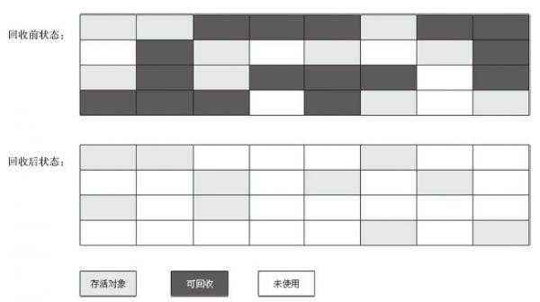
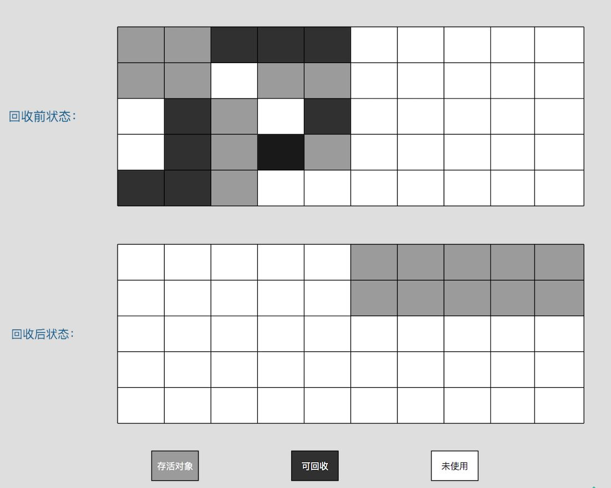
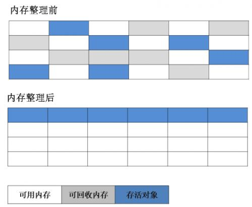

# 垃圾回收算法
各个平台的虚拟机操作内存的方法各有不同，这里只是介绍几种算法的思想及其发展过程
## 标记-清除算法

该算法是最基础的算法，后续的收集算法都是基于这种思路并堆其不足进行改进而得到的，算法分为两个阶段：
* 标记

    首先标记出所有需要回收的对象，对象标记判定[垃圾回收](gc.md)已经介绍过了
* 清除

    在标记完成后统一回收所有被标记的对象

它的主要不足有两个：
* 效率问题

    标记和清除两个过程的效率都不高
* 空间问题

    标记清除之后会产生大量不连续的内存碎片，空间碎片太多可能会导致以后在程序运行过程中需要分配较大对象时，无法找到足够的连续内存而不得不提前出发另一次垃圾收集动作

## 复制算法

为了解决效率问题，复制算法出现了，它将可用内存按容量划分为大小相等的两块，每次只使用其中的一块，当一块的内存用完了，就将还存活着的对象复制到另一块上面，然后再把已经使用过的内存一次清除掉，这样使得每次都是对整个半区进行内存回收，内存分配时也就不用考虑内存碎片等复杂情况

总体来说，实现简单，运行高效，只是这种算法的代价是将内存缩小为原来的一半，这个代价有点高了

现在的虚拟机都采用这种收集算法来回收新生代，研究表明新生代中的对象98%存活时间很短，所以并不需要按照1：1的比例来划分内存空间，而是将内存分为一块较大的Eden区和两块较小的Survivor区，每次只使用Eden和其中一块Survivor，当回收时，将Eden区和Survivor中还存活的对象一次性的复制到另一个Survivor区，最后清理Eden和刚用过的Survivor区，HotSpot虚拟机默认Eden和Survivor的大小比例时8：1，存活的对象超出了10%，Survivor区不够用，将会依赖老年代进行分配担保
## 标记-整理算法

复制收集算法在对象存活率较高时就要进行较多的复制操作，效率将会很低，最关键时不想浪费50%的内存空间，为了应对内存中所以对象都100%存活的极端情况，就需要有额外的空间进行分配担保，所以老年代一般不能直接使用这种算法

根据老年代的特点，有人提出了标记-整理算法，标记过程仍然和标记-清除算法一样，但后续步骤不是直接对可回收对象进行清理，而是让所有存活的对象都向一端移动，然后直接清理掉端边界以外的内存
## 分代收集算法
当前虚拟机的垃圾收集都采用分代收集算法，该算法并没有新思想，而是根据对象的存活周期不同将内存分为几块，一般把Java堆分为新生代和老年代，这样就可以根据各个年代的特点采用适当的收集算法

新生代存活率较低使用复制算法，老年代存活率较高，没有额外空间对它进行分配担保，就必须使用标记-清除或标记整理算法