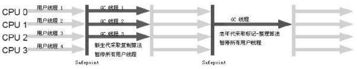

# 垃圾收集器
如果垃圾收集算法是内存回收的方法论，那么垃圾收集器就是内存回收的具体实现

如图所示不同收集器为不同的区域服务，不同的收集器相互配合收集新生代老年代，其中G1是最新的收集器

-|Serial|PanNew|Parallel Scavenge|Serial Old|Parallel Old|CMS|G1
---|---|---|---|---|---|---|---
JDK版本|-|1.3.1|1.4|-|-|1.5|-
作用区域|新生代|新生代|新生代|老年代|老年代|老年代|全部
算法|复制|复制|复制|-|-|server|-
线程|单线程|多线程|多线程|-|-|和用户线程并行|-
场景|client|server|-|-|-|server|-
JVM参数|-|-XX:UseParNewGC|-|-|-|-XX:+UseConcMarkSweepGC|-
## Serial收集器

最基本，发展历史最悠久的收集器，单线程的收集器，

这里单线程的意义不只是只需要一个CPU或一条线程完成垃圾收集工作，更重要的是垃圾收集时必须暂停其他所有的工作线程，直到收集结束

到目前为止，该收集器虚拟机运行在client模式下的默认新生代收集器，因为简单而高效，对于限定单个CPU的环境来说，它没有线程交互的开销，专心做垃圾收集自然可以获得最高的单线程收集效率

就用户的桌面应用场景中，分配给虚拟机的内存一般来说不会太高，收集几十兆甚至一两百兆的新生代，停顿时间完全可以控制在几十毫秒最多一百多毫秒内，只要不频繁发生都能接受
## ParNew收集器

其实就是Serial的多线程版本，共用了很多代码和JVM控制参数，比如-XX:SurvivorRatio等

作为CMS收集器的默认新生代收集器

ParNew收集器在单CPU环境下绝对不会有比Serial收集器更好的效果，不过现在CPU的增加，它对于GC时系统资源的有效利用还是很有好处的，默认开启的收集线程数与CPU的数量相同，可以通过-XX:ParallelGCThreads参数来限制线程数
## Parallel Scavenge收集器
它是新生代收集器，使用复制算法多线程收集器，它和其他收集器的关注点不同，CMS等收集器的关注点是尽可能地缩短垃圾收集时用户线程的停顿时间，而它的目的是达到一个可控制的吞吐量，吞吐量就是CPU用于运行用户代码的时间与CPU总耗时的比值

停顿时间越短越适合需要与用户交互的程序，良好的响应速度能提升用户体验，而高吞吐量可以高效率的利用CPU时间，主要适用于后台运算而不需要太多交互的任务

提供了两个参数用于精确控制吞吐量：
* 控制最大垃圾收集停顿时间-XX:MaxGCPauseMillis
    
    该值是大于0的毫秒数，它也不是越小越好，停顿时间下降的代价是新生代变小，垃圾收集发生的更频繁，吞吐量变低
* 直接设置吞吐量大小-XX:GCTimeRatio

    该值是0-100的正整数，默认值99相当于允许最大1%的垃圾收集时间
    
该收集器也叫做`吞吐量优先`收集器，可以通过参数-XX:+UseAdaptiveSizePolicy，系统可以自动调整新生代（-Xmn），Eden与Survivor区的比例（-XX:SurvivorRatio），晋升老年代对象年龄（-XX:PretenureSizeThreshold）