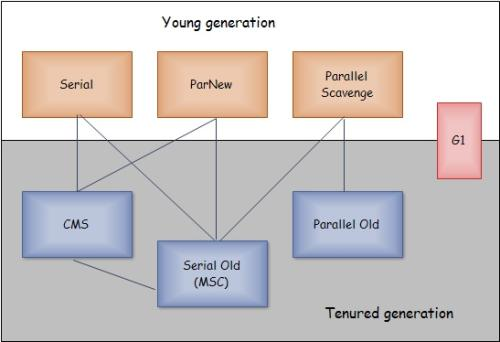

# 垃圾收集器
如果垃圾收集算法是内存回收的方法论，那么垃圾收集器就是内存回收的具体实现

如图所示不同收集器为不同的区域服务，不同的收集器相互配合收集新生代老年代，其中G1是最新的收集器

-|Serial|PanNew|Parallel Scavenge|Serial Old|Parallel Old|CMS|G1
---|---|---|---|---|---|---|---
JDK版本|-|1.3.1|1.4|-|1.6|1.5|1.7
作用区域|新生代|新生代|新生代|老年代|老年代|老年代|全部
算法|复制|复制|复制|标记-整理|标记-整理|标记-清除|标记-整理
线程|单线程|多线程|多线程|单线程|多线程|和用户线程并行|和用户线程并行
场景|client|server|server|client|server|server|server
JVM参数|-|-XX:UseParNewGC|-|-|-|-XX:+UseConcMarkSweepGC|-
## Serial收集器

最基本，发展历史最悠久的收集器，单线程的收集器，

这里单线程的意义不只是只需要一个CPU或一条线程完成垃圾收集工作，更重要的是垃圾收集时必须暂停其他所有的工作线程，直到收集结束

到目前为止，该收集器虚拟机运行在client模式下的默认新生代收集器，因为简单而高效，对于限定单个CPU的环境来说，它没有线程交互的开销，专心做垃圾收集自然可以获得最高的单线程收集效率

就用户的桌面应用场景中，分配给虚拟机的内存一般来说不会太高，收集几十兆甚至一两百兆的新生代，停顿时间完全可以控制在几十毫秒最多一百多毫秒内，只要不频繁发生都能接受
## ParNew收集器

其实就是Serial的多线程版本，共用了很多代码和JVM控制参数，比如-XX:SurvivorRatio等

作为CMS收集器的默认新生代收集器

ParNew收集器在单CPU环境下绝对不会有比Serial收集器更好的效果，不过现在CPU的增加，它对于GC时系统资源的有效利用还是很有好处的，默认开启的收集线程数与CPU的数量相同，可以通过-XX:ParallelGCThreads参数来限制线程数
## Parallel Scavenge收集器
它是新生代收集器，使用复制算法多线程收集器，它和其他收集器的关注点不同，CMS等收集器的关注点是尽可能地缩短垃圾收集时用户线程的停顿时间，而它的目的是达到一个可控制的吞吐量，吞吐量就是CPU用于运行用户代码的时间与CPU总耗时的比值

停顿时间越短越适合需要与用户交互的程序，良好的响应速度能提升用户体验，而高吞吐量可以高效率的利用CPU时间，主要适用于后台运算而不需要太多交互的任务

提供了两个参数用于精确控制吞吐量：
* 控制最大垃圾收集停顿时间-XX:MaxGCPauseMillis
    
    该值是大于0的毫秒数，它也不是越小越好，停顿时间下降的代价是新生代变小，垃圾收集发生的更频繁，吞吐量变低
* 直接设置吞吐量大小-XX:GCTimeRatio

    该值是0-100的正整数，默认值99相当于允许最大1%的垃圾收集时间
    
该收集器也叫做`吞吐量优先`收集器，可以通过参数-XX:+UseAdaptiveSizePolicy，系统可以自动调整新生代（-Xmn），Eden与Survivor区的比例（-XX:SurvivorRatio），晋升老年代对象年龄（-XX:PretenureSizeThreshold）
## Serial Old收集器
该收集器是老年代版本，他也是单线程收集器，一般运行再client模式下，如果再server模式下使用有两大用途：一种就是JDK1.5之前版本与Parallel Scavenge收集器配合使用，另一种是作为CMS收集器的后备方案，在并发收集发生Concurrent Mode Failure时使用
## Parallel Old收集器

该收集器是Parallel Scavenge收集器的老年代版本，使用多线程

该收集器出现之前，Parallel Scavenge收集器一直处于比较尴尬的位置，因为Parallel Scavenge收集器不能和CMS配合使用只能和Serial Old收集器配合使用，如果在server模式下使用，Serial Old收集器的单线程处理势必会拖累应用性能，还不如ParNew收集器与CMS配合使用来的给力

自从Parallel Old收集器出现后，Parallel Scavenge收集器才发挥了吞吐量优先的优势
## CMS收集器

CMS（Concurrent Mark Sweep）收集器是一种以获取最短回收停顿时间为目标的收集器，它的算法是标记-清除，对不前面的几种收集器来说整个过程分为以下4个步骤：
* 初始标记

    该步骤需要让用户线程暂停到一个安全点，这里只是简单标记一下GC Roots能直接关联到的对象，速度很快

* 并发标记

    进行GC Roots Tracing的过程

* 重新标记

    和初始标记一样需要暂停用户线程，为了修正并发标记期间因用户程序继续运行而导致标记产生变动的那一部分对象的标记记录，这一阶段的停顿时间一般会比初始标记阶段稍长一点，但远比并发标记时间短

* 并发清除

整个过程上来说耗时最长的并发标记和并发清除过程和用户线程是一起执行的，总体来说CMS收集器的内存回收过程是与用户线程是并发执行的

CMS是并发收集，低停顿的收集器，但是它还远远达不到完美的程度，它有以下三个明显的缺点：
* CMS收集器堆CPU资源非常敏感，其实面向并发设计的程序都堆CPU资源比较敏感
    
    并发阶段不会导致用户线程停顿，但是会因为占用了一部分CPU资源而导致应用程序变慢，总吞吐量会降低，CMS默认启动线程数是（CPU数+3）/4

* CMS收集器无法处理浮动垃圾，可能出现Concurrent Mode Failure失败而导致另一次Full GC的产生

    CMS并发清理阶段用户线程还在运行着，伴随程序运行自然就会有新的垃圾不断产生，这一部分垃圾出现在标记过程之后，CMS无法在当次收集中处理掉他们，只好待下一次GC时再清理掉
    
    也由于垃圾收集过程中用户线程需要执行，那么也就需要预留有足够的内存空间给用户线程使用，因此它不能像其他收集器一样等到老年代几乎完全被填满再进行收集，JDK1.6设置如果使用92%将激活CMS垃圾收集
    
* 因为算法标记-清除，垃圾收集后将产生大量的内存碎片
    
    因为这种情况，就算内存还很大，可是无法找到足够大的连续空间来分配当前对象，不得不提前触发一次Full GC

## G1收集器

G1（Garbage First）是最前沿的垃圾收集器，G1具备如下特点：
* 并发与并行
    
    G1能充分利用多CPU环境来缩短停顿时间，G1收集器可以通过并发的方式让用户线程继续执行

* 分代收集

    保留了分代的概念，虽然不需要其他收集器配合就能独立管理整个GC堆，但能够采用不同的方式处理新创建，已经存活一段时间和熬过多次GC的旧对象以获取更好的收集效果

* 空间整合

    它使用了标记-整理算法，从局部上来看是基于复制算法，但这两种算法都意味着G1运行期间不会产生内存空间碎片
    
* 可预测的停顿

    这是G1相对于CMS的另一大优势，处理追求低停顿外，还能建立可预测的停顿时间模型，让使用者明确指定在一个长度单位M毫秒的时间段内，消耗在垃圾收集上的时间不能超过N毫秒，这几乎实现了实时Java的垃圾收集器特征了
    
G1之前的收集器进行的收集范围都是整个新生代或老年代，而G1不再是这样了，G1将Java堆划分为多个大小相等的独立区域，虽然保留了新生代和老年代的概念，但是新生代和老年代不再是物理隔离的，他们都是一部分独立区域（不需要连续）的集合

G1收集器运作的大致步骤如下：
* 初始标记

    标记一下GC Roots能直接关联到的对象，并修改TAMS(Next Top at Mark Start)的值，让下一阶段用户程序并发运行时能在正确可用的区域创建新对象，这个阶段需要停顿线程，但耗时很短
    
* 并发标记

    从GC Roots开始对堆中对象进行可达性分析，找出存活的对象，这阶段耗时较长，但可与用户线程并发执行

* 最终标记

    为了修正并发标记期间因用户程序继续运行而导致标记产生变动的那一部分标记记录，这阶段需要停顿线程，但可多线程执行

* 筛选回收

    首先对各个区域的回收价值和成本进行排序，根据用户所期望的GC停顿时间来制定回收计划，其实这个阶段可以做到和用户线程一起并发执行，但是因为只回收一部分区域，时间时用户可控制的，而且停顿用户线程将大幅度提高收集效率