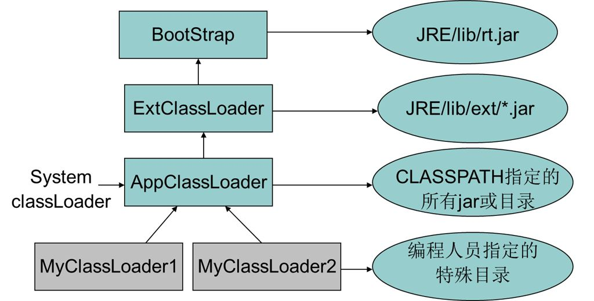

# 类的加载机制

一个Java类从.java文件编译成.class，然后被JVM使用，主要分为以下几个过程：加载、连接、初始化

## 加载
1. 通过一个类的全限定名来获取定义此类的二进制字节流
    * 从ZIP包中读取，比如JAR、EAR、WAR
    * 从网络中获取，比如Applet
    * 运行时计算生成，JDK动态代理，CGLib
    * 由其他文件生成，比如JSP
    * 从数据库中读取，比如oracle
2. 将这个字节流所代表的静态存储结构转化为方法区的运行时数据结构
3. 在内存中生成一个代表这个类的java.lang.Class对象，作为方法区这个类的各种数据的访问入口（反射的基础）

加载过程相对于其他过程，是开发人员可控性最强的，因为加载阶段既可以使用系统提供的引导加载器来完成，也可以有用户自定义的类加载器去完成
## 连接
## 初始化