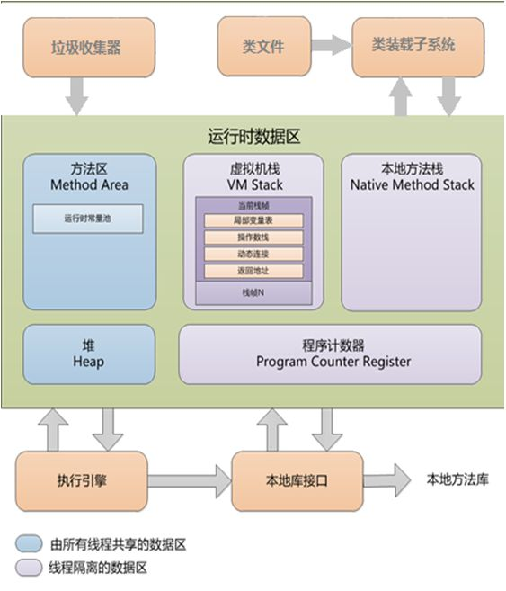

# 内存模型

操作系统有自身的内存模型，系统内存，用户内存

不同操作系统内存结构是有区别的，那么如何将Java代码编译一次后能够在不同的操作系统上运行呢？

这归功于Java虚拟机（JVM），屏蔽了操作系统相关的细节

## 程序计数器
    可理解为当前线程执行字节码的行号指示器，字节码解释器工作时就是通过改变这个计数器的值来选取下一条需要执行的字节码指令
    分支、循环、跳转、异常处理、线程恢复等基础功能都需要依赖这个计数器来完成
    该区域不会出现OOM
## 本地方法栈
    服务于执行本地方法（Native）
    该区域有可能出现OOM或StackOverflowError异常
## 虚拟机栈
    它的生命周期和线程相同，每个Java方法的执行会创建一个栈帧用于存储：变量表，操作数栈，动态连接，方法出口等信息
    局部变量表所需的内存空间在编译期间完成分配，当进入一个方法时，这个方法需要在帧中分配多大的局部变量空间是完成确定的
    该区域如果线程请求的栈深度大于虚拟机所允许的深度将抛出StackOverflowError异常
    如果虚拟机栈是动态扩展的，当无法申请足够内存，将出现OOM
## 方法区
    
## 堆