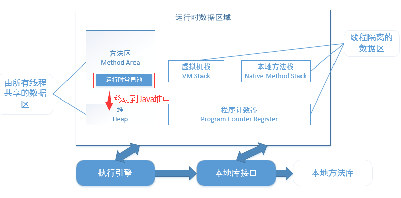
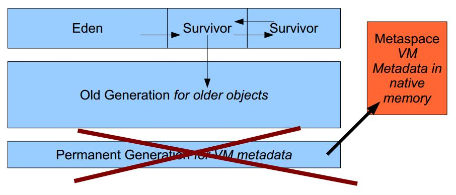

# 内存模型


操作系统有自身的内存模型，系统内存，用户内存

不同操作系统内存结构是有区别的，那么如何将Java代码编译一次后能够在不同的操作系统上运行呢？

这归功于Java虚拟机（JVM），屏蔽了操作系统相关的细节

## 程序计数器
    可理解为当前线程执行字节码的行号指示器，字节码解释器工作时就是通过改变这个计数器的值来选取下一条需要执行的字节码指令
    分支、循环、跳转、异常处理、线程恢复等基础功能都需要依赖这个计数器来完成
    该区域不会出现OOM
## 本地方法栈
    服务于执行本地方法（Native）
    该区域有可能出现OOM或StackOverflowError异常
## 虚拟机栈
    它的生命周期和线程相同，每个Java方法的执行会创建一个栈帧用于存储：变量表，操作数栈，动态连接，方法出口等信息
    局部变量表所需的内存空间在编译期间完成分配，当进入一个方法时，这个方法需要在帧中分配多大的局部变量空间是完成确定的
    该区域如果线程请求的栈深度大于虚拟机所允许的深度将抛出StackOverflowError异常（递归）
    如果虚拟机栈是动态扩展的，当无法申请足够内存，将出现OOM，控制参数-Xss

通过代码模拟溢出
```java
    private static void stackOverFlowError() {
        try {
            stackOverFlowError();
        } catch (Error e) {
            e.printStackTrace();
        }
    }
```
## 方法区
    以上三个都是线程独立的，该区域属于线程共享，用于存储：类信息，常量，静态常量，即是编译器编译后的代码等数据
    一般称为非堆（Non-Heap）目的就是和Java堆区分开来，从GC的角度也称为永久代（其实并不是不能被回收只是回收的条件比较苛刻）
    该区域也会出现OOM PermGen space，比如启动一个tomcat将-XX:MaxPermSize=1M
JDK8将永久代移除了，将元数据存放到和堆独立的一个叫元空间的本地内存中，将字符串常量移到堆中





这么操作的原因是早期版本不好设置永久代大小，如果设置的太小容易报OOM PermGen space

元空间是JVM规范中方法区的一种实现，本地内存不在虚拟机中

下面通过几个例子验证下
```java
public class JDK8OOM {

    static String base = "string";

    public static void main(String[] args) {
//        stringConstantInHeap();
        metaSpaceOOM();
    }

    /**
     * 字符串常量分配在堆上，设置堆大小为10M：-Xmx10m
     */
    private static void stringConstantInHeap() {
        List<String> list = new ArrayList<String>();
        for (int i = 0; i < Integer.MAX_VALUE; i++) {
            String str = base + base;
            base = str;
            list.add(str.intern());
        }
    }

    /**
     * 类加载元数据信息保存到元空间（本地内存），设置元空间大小8M：-XX:MaxMetaspaceSize=8m
     */
    private static void metaSpaceOOM() {
        try {
            //获取有关类型加载的JMX接口
            ClassLoadingMXBean loadingBean = ManagementFactory.getClassLoadingMXBean();
            //用于缓存类加载器
            List<ClassLoader> classLoaders = new ArrayList<ClassLoader>();
            while (true) {
                //加载类型并缓存类加载器实例
                ClassLoader classLoader = new LoaderClass.MyClassLoader();
                classLoaders.add(classLoader);
                classLoader.loadClass("jvm.LoaderClass");
                //显示数量信息（共加载过的类型数目，当前还有效的类型数目，已经被卸载的类型数目）
                System.out.println("total: " + loadingBean.getTotalLoadedClassCount());
                System.out.println("active: " + loadingBean.getLoadedClassCount());
                System.out.println("unloaded: " + loadingBean.getUnloadedClassCount());
            }
        } catch (Exception e) {
            e.printStackTrace();
        }
    }
}
```
## 堆
    该区域也是线程共享的，Java堆JVM内存最大的一块，主要存储一些对象实例，还有数组
    不过随着JIT编译器的成熟，所有对象分配在堆上已经不是"绝对"的事了
    垃圾回收（GC）主要就是管理这一部分内存
    从分代收集的角度看，堆可以分为新生代和老年代，其中新生代可以再分为Eden空间、From Survivor空间和To Survivor空间
    如果内存溢出将出现OOM Java heap space，该区域可以通过-Xmx和-Xms参数控制

```java
    private static int size = 1024 * 1024;
    /**
     * 设置最大堆内存为5M，-Xmx5m，程序分配10M内存
     *
     * @param count 几兆
     * @return
     */
    private static Byte[] heapOOM(int count) {
        Byte b[] = new Byte[size * count];
        return b;
    }
```
## 直接内存
    JVM以外的一块内存空间，可通过DirectByteBuffer对象作为这块内存的引用进行操作

## 例子
jvm.memory.OOM